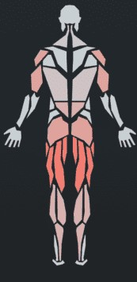

# About

This is a formula for my favorite type of workout. To do this workout you choose two muscle groups (one **big** and one *small*) and choose appropriate exercises for each section.

> Strength does not come from winning. Your struggles develop your strengths. When you go through hardships and decide not to surrender, that is strength.

Arnold Schwarzenegger

# Terminology

1. Set
2. Rep
3. Superset

# Muscle Groups

## Big Muscle Groups

- **Upper Back**
- **Lower Back**
- **Chest**
- **Legs**
- **Shoulders**

## Small Muscle Groups

- *Biceps*
- *Triceps*
- *Calves*
- *Abdominals*

# The Workout

## Warmup

1. Cardio: 10-15 minutes
2. Stretch

## Part 1: Main Muscle Group

Your **main muscle group** should be your **big muscle group** for the day.

### Heavy Exercise

1. 2 Warmup sets (10 reps)
2. 5 Working sets (5 reps)

### Light Exercise

1. 1 Warmup set (10 reps)
2. 3 Working sets (8 reps)

## Part 2: Secondary Muscle Group (Superset)

Your *secondary muscle group* should be your *small muscle group* for the day. This is done in a superset so exercises are done back to back one set at a time.

### Heavy Exercise

1. 1 Warmup set (10 reps)
2. 4 Working sets (8 reps)

### Lighter Exercise

1. 3 Working sets (10 reps)

## Part 3: Muscle Group Closer

### Main Muscle Group Closer

1. 3 sets (10 reps)

### Secondary Muscle Group Closer

1. 3 sets (10 reps)

## Core (Superset)

### Abdominals

1. 3 sets

### Lower Back

1. 3 sets

# Exercises

## Big Muscle Groups

### Upper Back

#### Heavy

- Rows (Any Variant)
- Lat Pull Down

#### Light

- Pullups (Any Variant)
- Flys (Any Variant)

### Lower Back

#### Heavy

- Deadlift (Any Variant)
- Good Mornings

#### Light

- Superman
- Hyperextensions (Any Variant)
- Jefferson Curl

### Chest

#### Heavy

- Barbell Bench Press (Any Variant)
- Dumbbell Bench Press (Any Variant)

#### Light

- Pushups
- Cable Crossover (Any Variant)
- Dumbbell Flyes (Any Variant)

### Legs

#### Heavy

- Squats (Any Variant)
- Leg Press (Any Variant)
- Deadlift

#### Light

- Lunges
- Jump Rope
- Lying Leg Curls
- Leg Extensions

### Shoulders

#### Heavy

- Military Press
- Arnold Press
- Dumbbell Press
- Shrugs

#### Light

- Lateral Raise
- Front Raise
- Face Pull

## Small Muscle Groups

### Biceps

#### Heavy

- Hammer Curls
- Preacher Curls
- Barbell Curl
- Dumbbell Bicep Curl

#### Light

- EZ-Bar Curl
- 21s

### Triceps

#### Heavy

- Close Grip Bench Press
- Dumbell Tricep Extension
- Tricep Press

#### Light

- Dips
- Tricep Push Downs
- Skull Crushers
