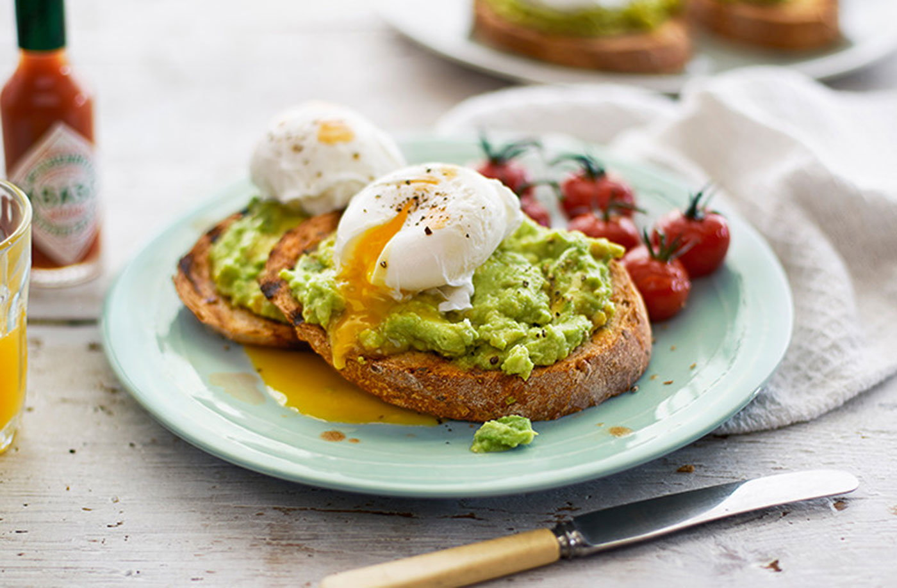

# About

I typically have time to cook a nice breakfast on Saturday mornings. My favorite is Avocado Toast with Egg.

- **Prep:** 10 mins
- **Cook:** 5 mins
- **Total:** 15 mins
- **Servings:** 1 serving
- **Total Cost:** $4.00

# Ingredients

- [Whole Wheat English Muffin](https://primenow.amazon.com/dp/B074H6R68R?qid=1566848952&m=ANOZNJWOJO2HN&sr=1-1&ref_=pn_sr_sg_1_img_ANOZNJWOJO2HN): $0.45
- 1 [Avocado](https://primenow.amazon.com/dp/B07C5ZMJ5H?qid=1566848755&m=ANOZNJWOJO2HN&sr=1-1&ref_=pn_sr_sg_1_img_ANOZNJWOJO2HN): $2.99
- 2 [Eggs](https://primenow.amazon.com/dp/B07PFDYT9T?qid=1566848811&m=ANOZNJWOJO2HN&sr=1-5&ref_=pn_sr_sg_5_img_ANOZNJWOJO2HN): $0.50
- [Butter](https://primenow.amazon.com/dp/B074VDJ7KZ?qid=1566848883&m=ANOZNJWOJO2HN&sr=1-2&ref_=pn_sr_sg_2_img_ANOZNJWOJO2HN): $0.06/ounce

# Directions

1. Melt 2 teaspoons of butter in a skillet over medium heat.
2. Add the eggs to the skillet.
3. Allow the egg whites to cook until mostly firm before breaking the yokes.
4. Break the yokes and continue cooking until eggs are completely cooked and no longer runny (2-3 minutes).
5. Cut english muffins into two slices and place in toaster.
6. [Cut open the avocado](https://www.realsimple.com/food-recipes/cooking-tips-techniques/preparation/slice-dice-avocado)
7. Use one half of the avocado per slice of english muffin. Remove the avocado from its shell and smear it on the english muffin.
8. Distribute the eggs evenly onto the toast.
9. Enjoy!

# Notes

You may want to change the style of the egg, type of bread, or add extra ingredients. Tomatoes, bacon, onion, and salsa all go great with this breakfast. Feel free to experiment!

# Inspired By

- [Perfect Breakfast](https://www.allrecipes.com/recipe/221304/perfect-breakfast/)
- [Avocado Toast (Vegan)](https://www.allrecipes.com/recipe/246803/avocado-toast-vegan/?internalSource=hub%20recipe&referringContentType=Search&clickId=cardslot%205)
